# Compte-rendu — TP Routage RSX2
**Nom / Prénom :*TAGBA KIBALO BENI*  
**Binôme :*REGUII Bilel*  

---

## Section 1 — Routage statique

---

### Question 1 — Table de routage initiale des routeurs
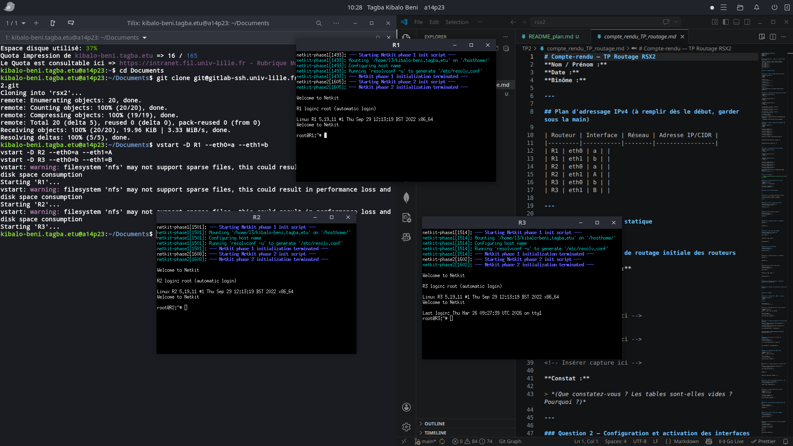
**Commandes utilisées :**
```bash
ip route
```

**Capture R1 :**
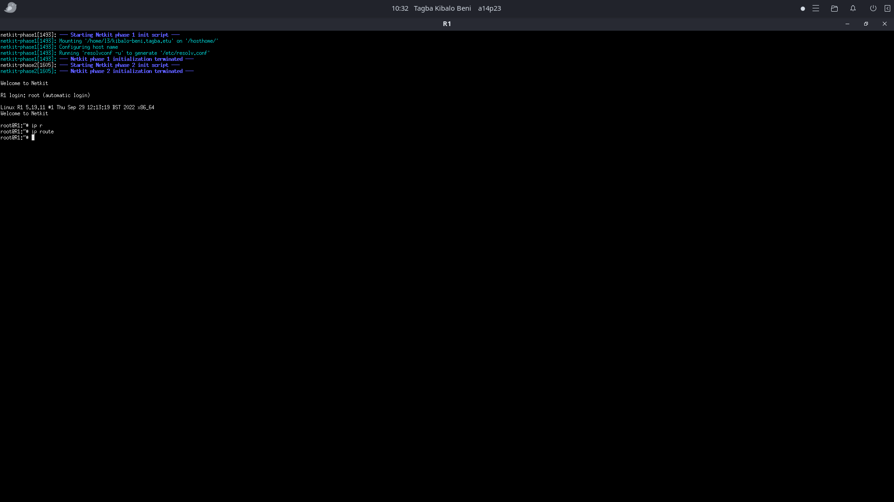

**Capture R2 :**
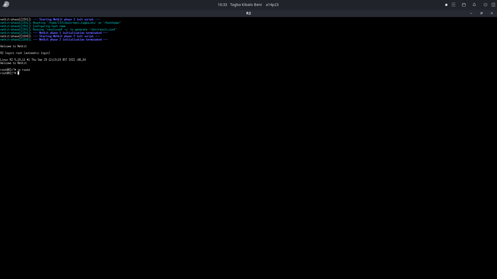

**Capture R3 :**

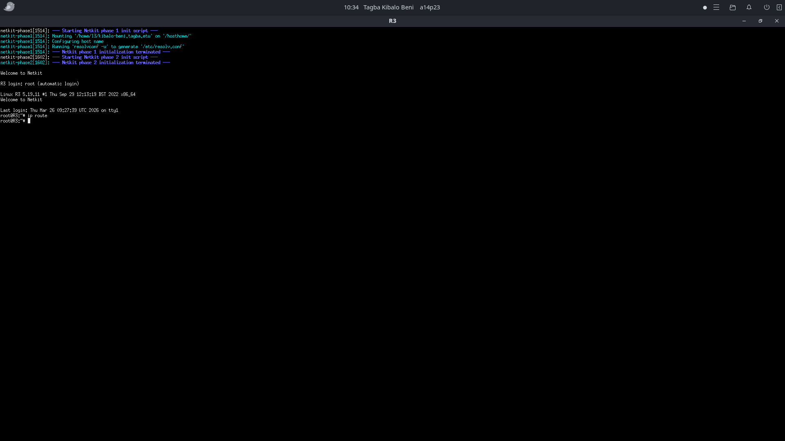

**Constat :**

> On constate que rien ne s'affiche du au fait qu'aucune route n'a encore été configuré

---

### Question 2 — Configuration et activation des interfaces

**Commandes utilisées sur R1 :**
```bash
ip address add 211.230.193.1/26 dev eth0
ip address add 211.230.193.129/26 dev eth1
ip link set dev eth0 up
ip link set dev eth1 up
```

**Commandes utilisées sur R2 :**
```bash
ip address add 211.230.193.2/26 dev eth0
ip address add 211.230.193.65/26 dev eth1
ip link set dev eth0 up
ip link set dev eth1 up
```

**Commandes utilisées sur R3 :**
```bash
ip address add 211.230.193.130/26 dev eth0
ip address add 211.230.193.193/26 dev eth1
ip link set dev eth0 up
ip link set dev eth1 up
```

**Vérification — `ip address` sur R1 :**
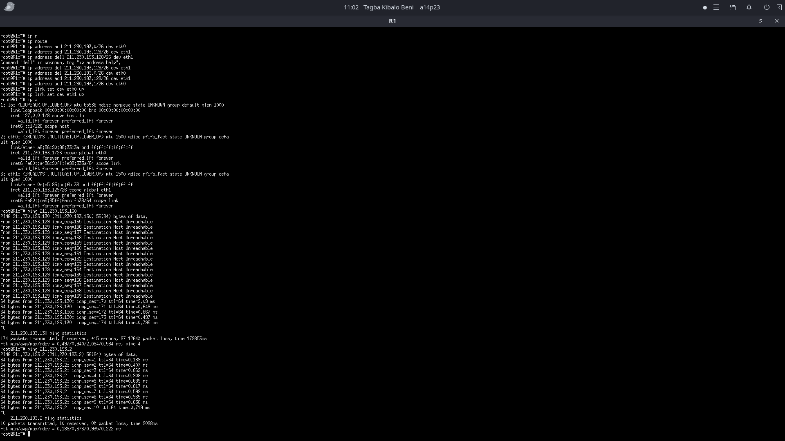

**Vérification — `ip address` sur R2 :**
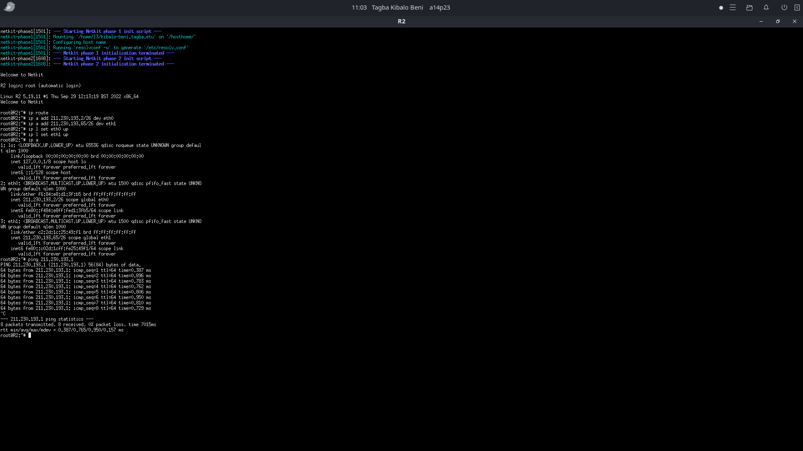

**Vérification — `ip address` sur R3 :**
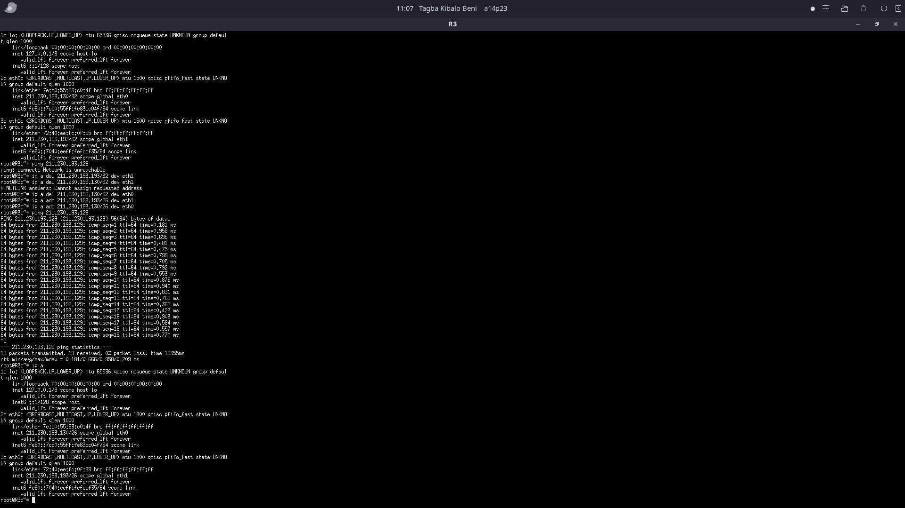


**Explication — comment vérifier que la configuration est correcte :**

> `ip address` affiche les IPs, ping vers voisin direct répond.

---

### Question 3 — Table de routage après configuration des interfaces

**Commandes utilisées :**
```bash
ip route
```

**Table de routage R1 R2 R3 :**
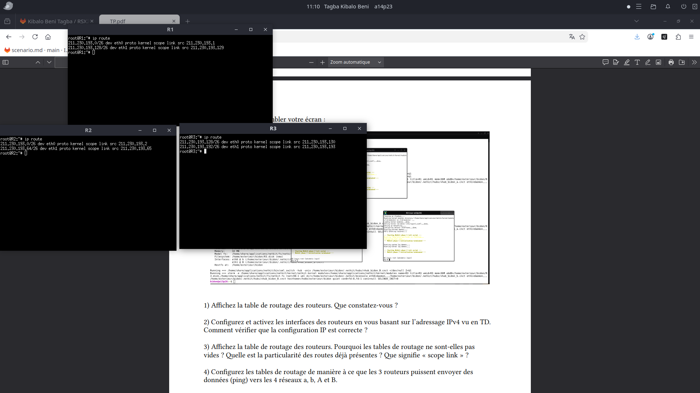

**Pourquoi les tables ne sont-elles pas vides ?**

> les tables de routage ne sont pas vide car on y a ajouter les addresse des interfaces

**Particularité des routes déjà présentes :**

> Les routes présentes ont la mention **`scope link`** 

**Signification de « scope link » :**

> `scope link` = destination accessible directement sur le lien local, sans passerelle

---

### Question 4 — Configuration des routes statiques

**Commandes ajoutées sur R1 :**
```bash
ip route add 211.230.193.64/26 via 211.230.193.2
ip route add 211.230.193.192/26 via 211.230.193.130
```

**Commandes ajoutées sur R2 :**
```bash
ip route add 211.230.193.128/26 via 211.230.193.1
ip route add 211.230.193.192/26 via 211.230.193.1
```

**Commandes ajoutées sur R3 :**
```bash
ip route add 211.230.193.0/26 via 211.230.193.129
ip route add 211.230.193.64/26 via 211.230.193.129
```

**Table de routage finale R1 & Vérification pings :**
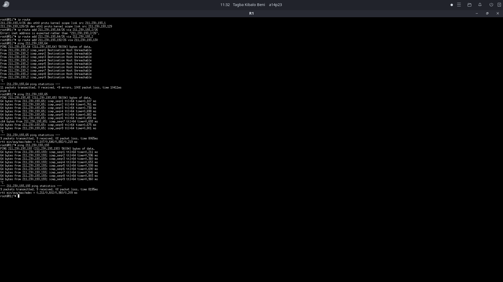

**Table de routage finale R2 & Vérification pings :**
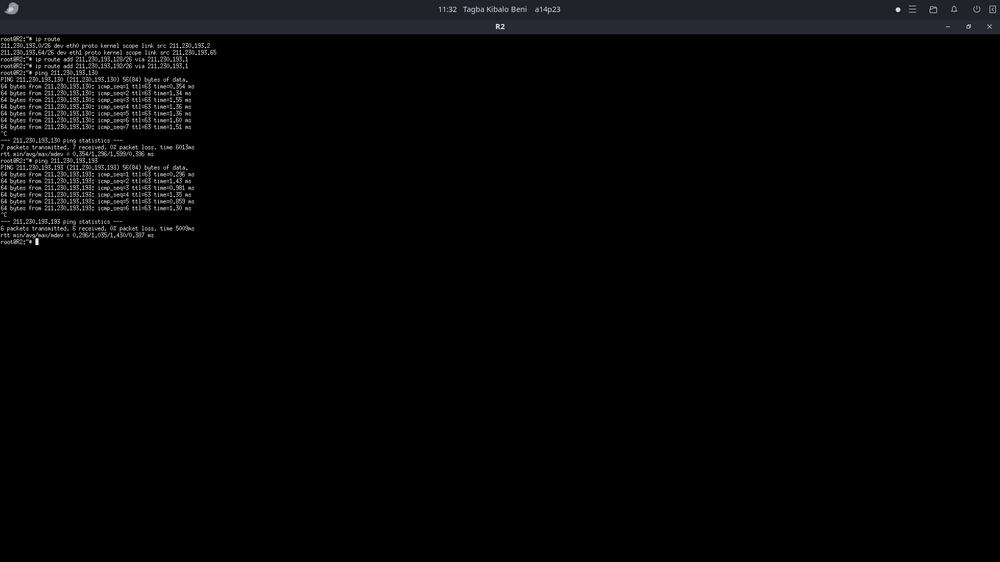

**Table de routage finale R3 & Vérification pings :**
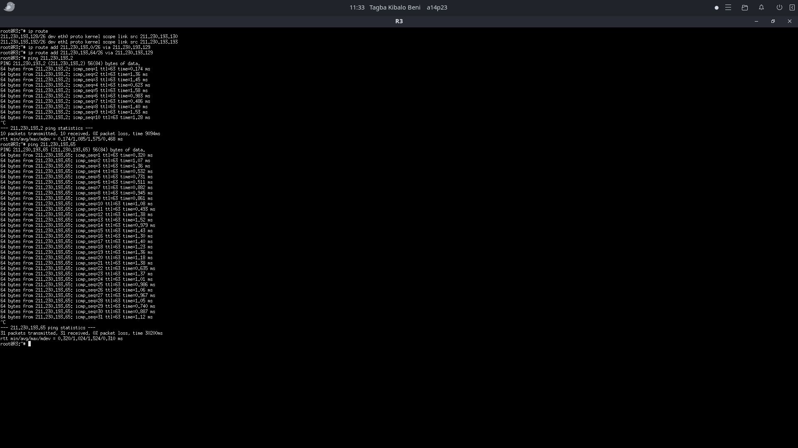

Tous les pings répondent depuis les 3 routeurs.

---

## Section 2 — Traceroute


---

### Question 1 — Traceroute depuis R2 vers réseau B

**Commande utilisée :**
```bash
traceroute -q1 -N1 211.230.193.193
```

**Sortie de la commande :**
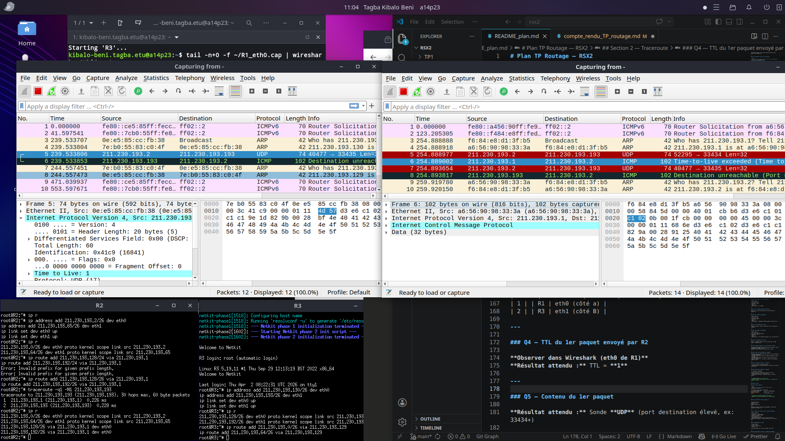
---

### Question 2 — Que renvoie traceroute ?

> Liste des routeurs traversés avec leur IP et temps de réponse en ms.


---

### Question 3 — Correspondance des adresses renvoyées

| Adresse IP renvoyée | Routeur | Interface |
|---------------------|---------|-----------|
| 211.230.193.1       |   R1    |  eth0     |
| 211.230.193.193     |   R3    |  eth1     |

---

### Question 4 — TTL du 1er paquet envoyé par R2

**Capture Wireshark (1er paquet) :**
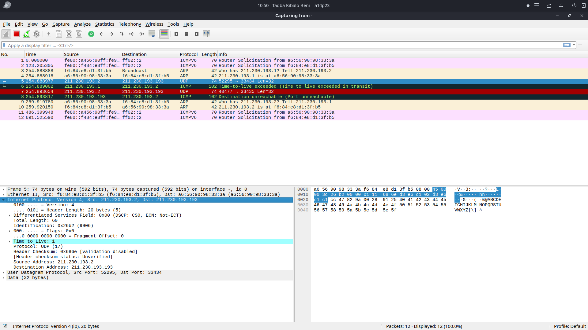

**Valeur du TTL :**

> 1

---

### Question 5 — Que transporte ce paquet ?

**Capture Wireshark :**
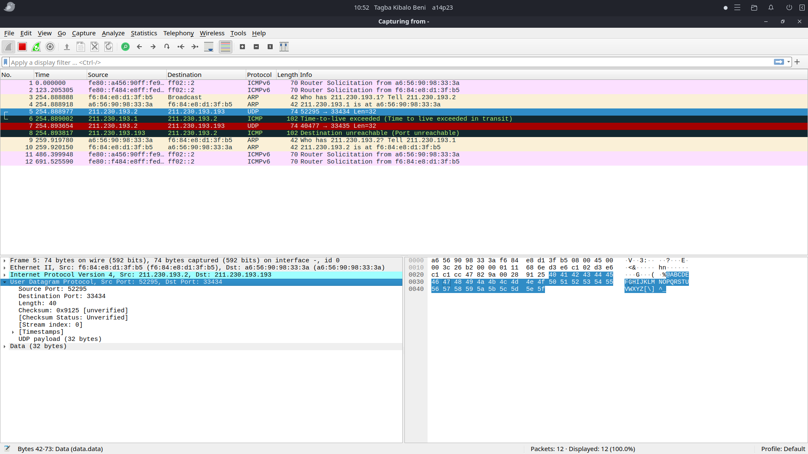


---

### Question 6 — Ce paquet parvient-il à destination ?

**Réponse :**

> Non

**Pourquoi :**

> TTL = 1 décrémenté à 0 par R1 → R1 jette le paquet.

---

### Question 7 — Qui répond ? Quel message ?

**Capture Wireshark de la réponse :**
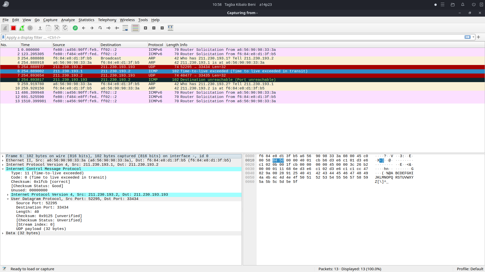
**Qui répond :**

> R1

**Protocole / Type / Code :**

> ICMP / Type : 11 / Code : 0

**Signification :**

> Time to Live exceeded in transit

---

### Question 8 — TTL du 2ème paquet

**Capture Wireshark :**
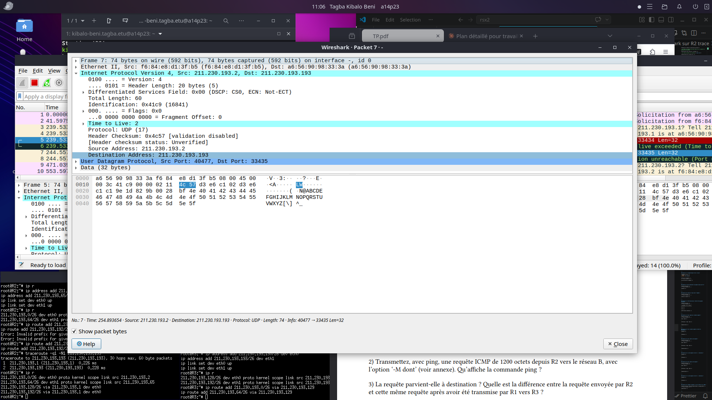

**Valeur du TTL :**

> 2

---

### Question 9 — Ce paquet parvient-il à destination ?

**Réponse :**

> Oui

**Pourquoi :**

> TTL = 2, R1 le décrémente à 1 et le transmet à R3

---

### Question 10 — Qui répond ? Quel message ?

**Capture Wireshark :**
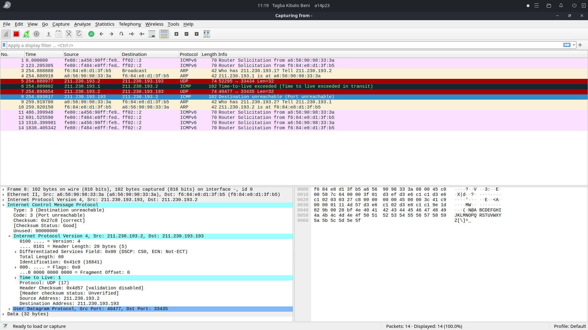
**Qui répond :**

> R3

**Protocole / Type / Code :**

> ICMP / Type : 3 / Code : 3

**Signification :**

> Destination unreachable — Port unreachable (le port UDP 33434 n'est pas ouvert sur R3)

---

### Question 11 — Messages permettant à traceroute de connaître les IPs des routeurs

> Le message ICMP Type 11 Code 0 renvoyé par R1 pour le 1er paquet. L'adresse source de ce message ICMP est l'IP de R1 — c'est comme ça que traceroute sait qu'il y a un routeur R1 sur le chemin. 

---

### Question 12 — Pourquoi l'IP de eth0 de R3 n'est-elle pas renvoyée ?

> eth0 de R3 est l'interface qui reçoit le 2ème paquet et Il répond avec ICMP Type 3 Code 3 depuis son interface eth1 , car c'est l'interface associée à l'adresse de destination demandée.

---

## Section 3 — Tracepath

---

### Question 1 — Configurer MTU à 1000 sur la liaison b

**Commandes utilisées :**
```bash
# Sur R1 : 
ip link set dev eth1 mtu 1000

# Sur R3 :
ip link set dev eth0 mtu 1000
```

**Vérification :**
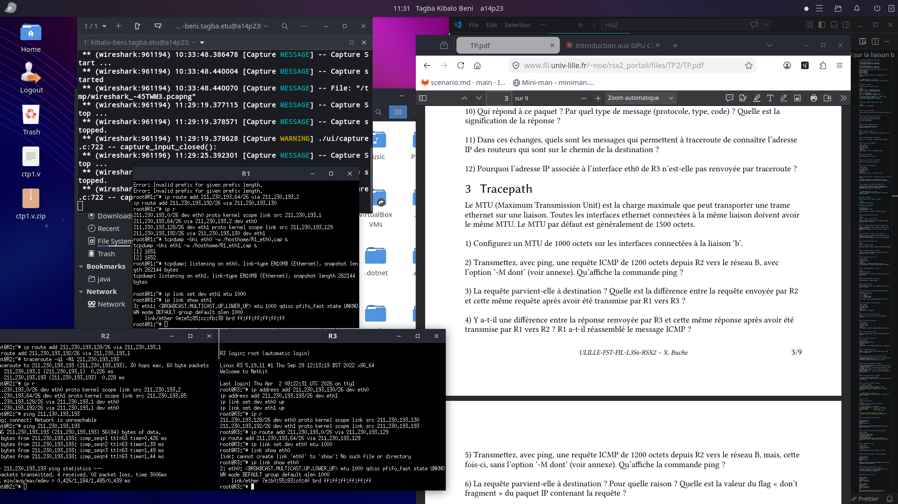
---

### Question 2 — Ping 1200 octets avec `-M dont` depuis R2

**Commande utilisée :**
```bash
ping -c1 -s 1200 -M dont 211.230.193.192
```

**Sortie de ping :**
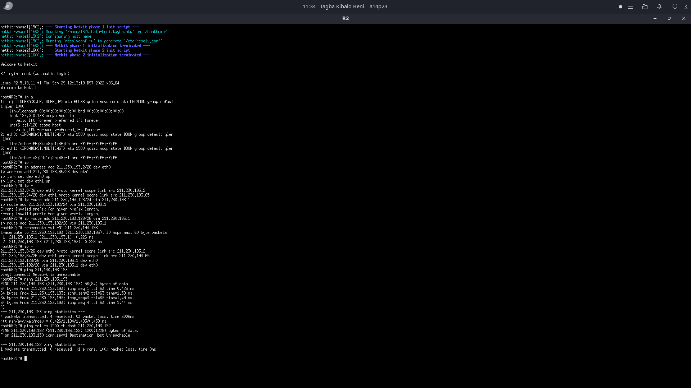

**Ce qu'affiche la commande :**

> From 211.230.193.130 icmp_seq=1 Destination Host Unreachable 1 packets transmitted, 0 received, +1 errors, 100% packet loss, time 0ms

---

### Question 3 — La requête parvient-elle ? Différence avant/après R1 ?

**Capture Wireshark eth0 de R1 (avant transmission) :**
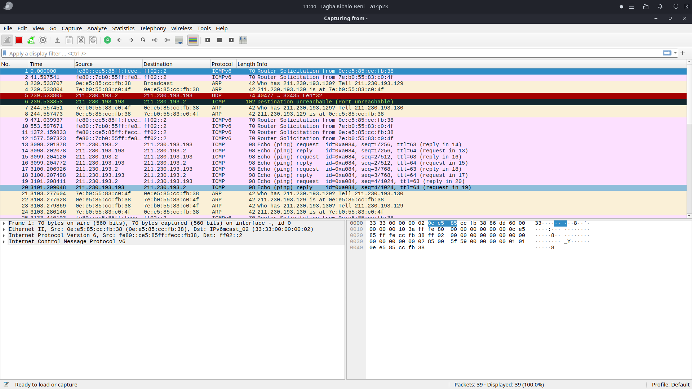

**Capture Wireshark eth1 de R1 (après transmission) :**
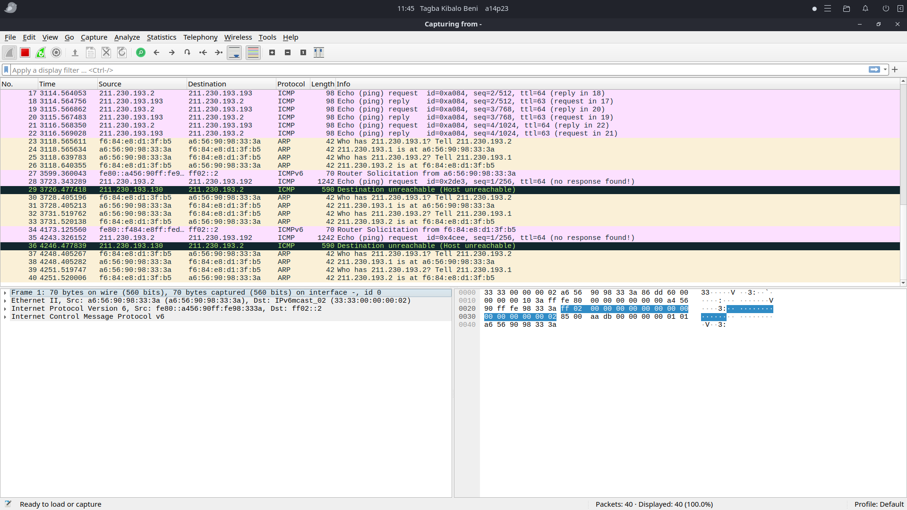

**La requête parvient-elle à destination ?**

> Non, la requête ne parvient pas à destination

**Différence entre la requête envoyée par R2 et après transmission par R1 :**

> Le lien entre R1 et R3 a un MTU inférieur à 1228 octets. Or l'option -M dont interdit la fragmentation. R1 se retrouve donc dans une situation impossible :le paquet est trop grand pour le lien vers R3, il n'a pas le droit de le fragmenter .R1 abandonne le paquet et renvoie à R2 un message ICMP Destination Host Unreachable . La requête n'arrive jamais jusqu'à R3.

---

### Question 4 — Différence sur la réponse ? R1 réassemble-t-il ?


**Y a-t-il une différence sur la réponse ?**

> Cette question ne s'applique pas ici, car la requête n'ayant jamais atteint R3, il n'y a aucune réponse de R3. 

**R1 réassemble-t-il le message ICMP ?**

> R1 n'a donc pas réassemblé

---

### Question 5 — Ping 1200 octets SANS `-M dont`

**Commande utilisée :**
```bash
ping -c1 -s 1200 211.230.193.192
```

**Sortie de ping :**
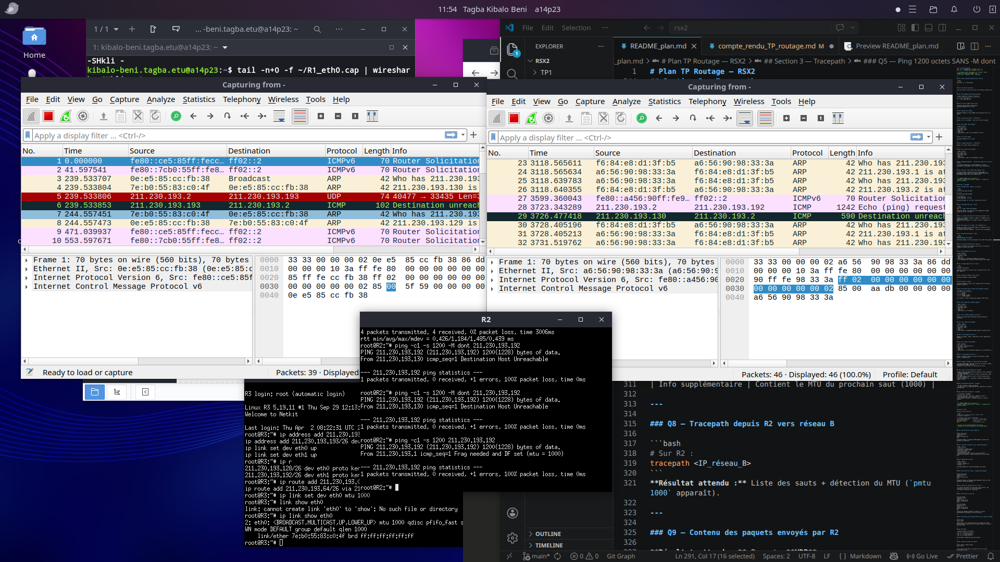

**Ce qu'affiche la commande :**

>PING 211.230.193.192 (211.230.193.192) 1200(1228) bytes of data.
>From 211.230.193.1 icmp_seq=1 Frag needed and DF set (mtu = 1000)

>-- 211.230.193.192 ping statistics ---
>1 packets transmitted, 0 received, +1 errors, 100% packet loss, time 0ms


---

### Question 6 — La requête parvient-elle ? Valeur du flag DF ?

**Capture Wireshark  :**
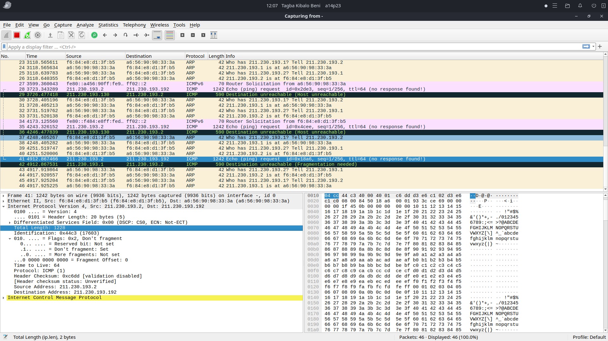

**La requête parvient-elle ?**

> Non.

**Raison :**

> Malgré l'absence de -M dont, Linux positionne DF = 1 automatiquement. R1 ne peut donc toujours pas fragmenter.

---

### Question 7 — Quel avertissement R1 renvoie-t-il à R2 ?

**Capture Wireshark du message ICMP :**
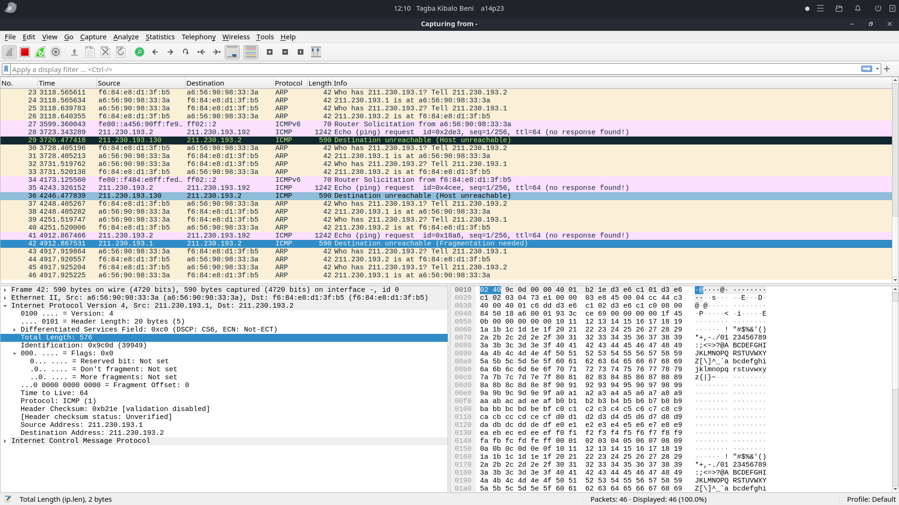

**Type / Code / Signification :**

> "Fragmentation Needed and DF bit set, mtu = 1000" — ce qui indique que le prochain saut a un MTU de 1000 octets.

---

### Question 8 — Tracepath depuis R2 vers réseau B

**Commande utilisée :**
```bash
tracepath 211.230.193.193
```

**Sortie de tracepath :**
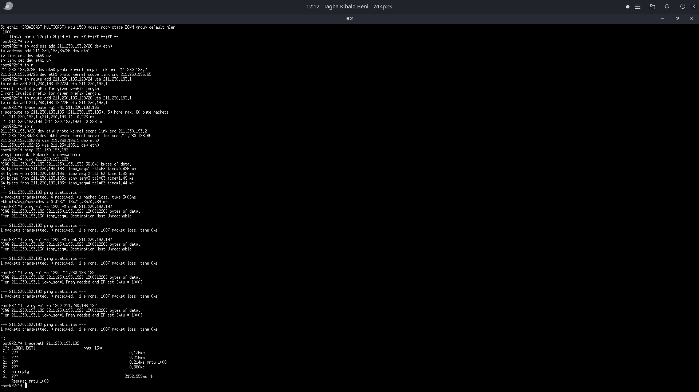

**Ce qu'affiche la commande :**

> iste des sauts + détection du MTU

---

### Question 9 — Que transportent les paquets envoyés par R2 ?

**Capture Wireshark :**
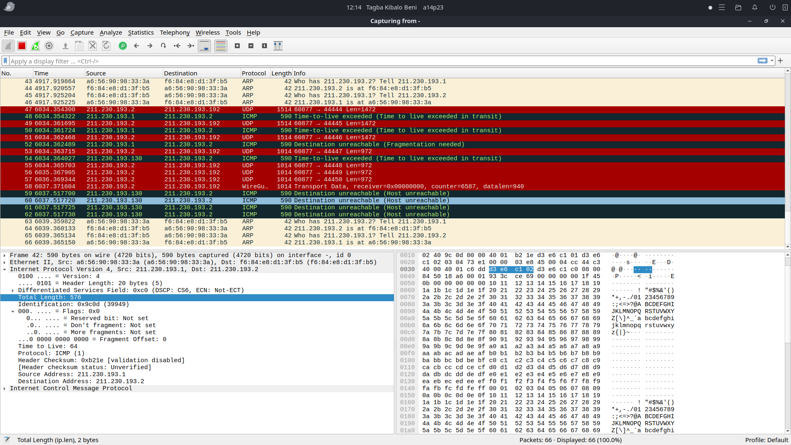

**Réponse :**

> Paquets **UDP**

---

### Question 10 — Valeur du flag « don't fragment »

**Capture Wireshark :**
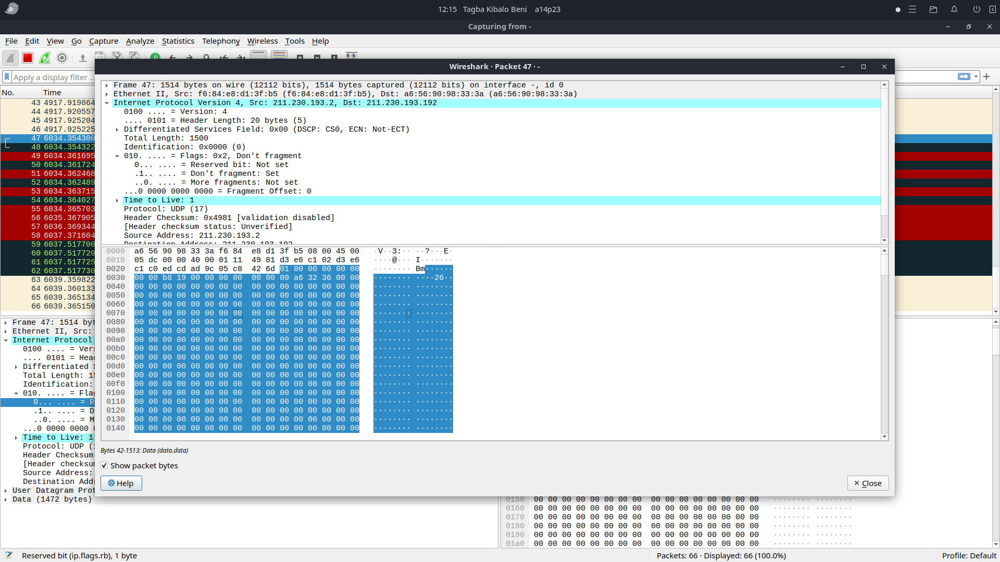

**Valeur du flag DF :**

> 1

---

### Question 11 — Différences dans l'entête IP des paquets successifs

**Capture Wireshark :**
<!-- Insérer capture ici -->

| N° paquet | TTL | Taille |
|-----------|-----|--------|
| 1 | | |
| 2 | | |
| 3 | | |
| 4 | | |

**Différences constatées :**

>

---

### Question 12 — Qui répond aux 2 premiers paquets ?

**Capture Wireshark :**
<!-- Insérer capture ici -->

**Qui répond :**

>

**Protocole / Type / Code :**

>

**Signification :**

>

---

### Question 13 — Les 2 premiers paquets arrivent-ils à destination ?

**Réponse :**

>

**Pourquoi :**

>

---

### Question 14 — Qui répond au 3ème paquet ?

**Capture Wireshark :**
<!-- Insérer capture ici -->

**Qui répond :**

>

**Protocole / Type / Code :**

>

**Signification :**

>

---

### Question 15 — Le 3ème paquet arrive-t-il à destination ?

**Réponse :**

>

**Pourquoi :**

>

---

### Question 16 — Qui répond au 4ème paquet ?

**Capture Wireshark :**
<!-- Insérer capture ici -->

**Qui répond :**

>

**Protocole / Type / Code :**

>

**Signification :**

>

---

### Question 17 — Le 4ème paquet arrive-t-il à destination ?

**Réponse :**

>

**Pourquoi :**

>

---

### Question 18 — Comment tracepath a su que le MTU de b est 1000 ?

**Capture Wireshark (champ Next-Hop MTU dans le message ICMP) :**
<!-- Insérer capture ici -->

**Explication :**

>

---

### Question 19 — Résumé du fonctionnement de tracepath

>

---

### Question 20 — Similitudes entre traceroute et tracepath

>

---

### Question 21 — Différences entre traceroute et tracepath

>

---

## Section 4 — RIP


### Question 1 — Activer RIP sur réseau a depuis R1

**Commandes utilisées :**
```
configure terminal
router rip
network 211.230.193.0/24
exit
```

**Capture Wireshark après activation :**
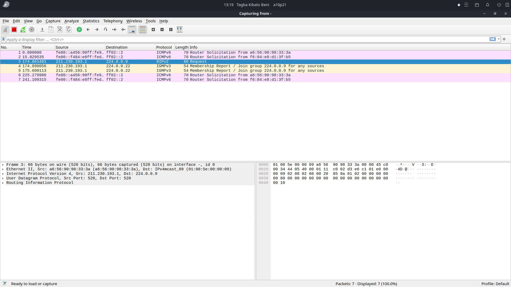

**Constat :**

>  Messages RIP Request visibles dans Wireshark sur eth0 de R1.

---

### Question 2 — Couche OSI, protocole transport, ports, adresse destination

**Couche OSI :**

> Couche application

**Protocole de couche transport :**

> UDP

**Ports source / destination :**

> Port source : 520 / destination : 520

**Adresse IP de destination :**

> 224.0.0.9

**Ce que représente cette adresse :**

> Groupe multicast de tous les routeurs RIP 

---

### Question 3 — Command RIP et version


**Command :**

> Request (1)

**Version :**

> RIPv2 (2)

---

### Question 4 — Activer RIP sur réseau b, fréquence des messages

**Commandes utilisées :**
```
configure terminal
router rip
network 211.230.193.128/26
exit
```

**Capture Wireshark :**
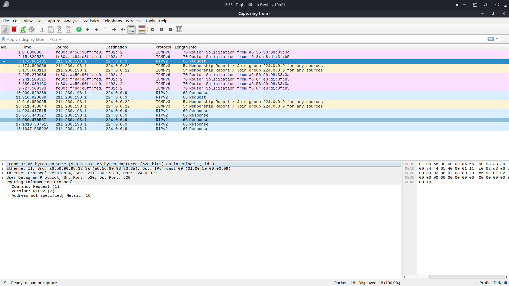

**Constat :**

> Des messages RIPv2 Response apparaissent (paquets 10, 11, 14, 15, 16, 17, 18...) en provenance de 211.230.193.1 (R1) vers 224.0.0.9.

**Fréquence d'envoi des messages :**

> paquet 10 à 909s, paquet 14 à 924s, paquet 15 à 953s, paquet 16 à 989s, paquet 17 à 1019s, paquet 18 à 1047s. L'écart entre les groupes est d'environ 30 secondes 

---

### Question 5 — Contenu des réponses RIP sur a et sur b

**Capture Wireshark réponses sur a :**
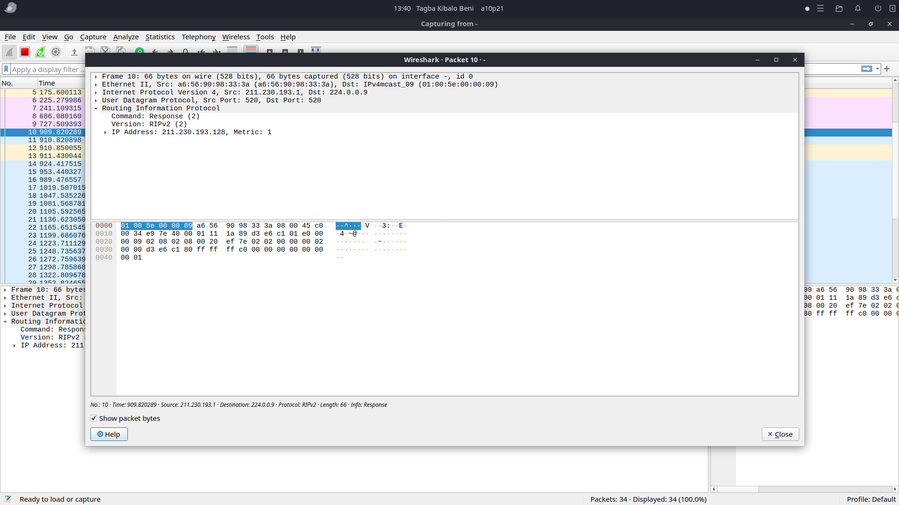

**Capture Wireshark réponses sur b :**
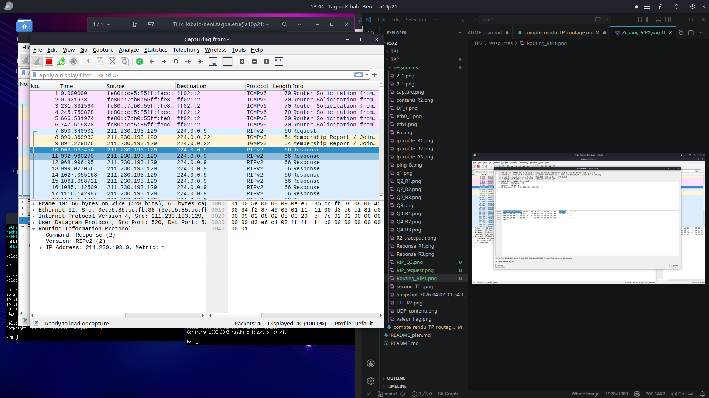

**Contenu sur a :**

> Sur a (eth0) → R1 annonce le réseau b (211.230.193.128/26) avec métrique 1

**Contenu sur b :**

>Sur a (eth0) → R1 annonce le réseau b (211.230.193.0/26) avec métrique 1

---

### Question 6 — Activer RIP sur R2 et R3 — intérêt du message de requête

**Commandes sur R2 :**
```
configure terminal
router rip
network 211.230.193.0/26
network 211.230.193.64/26
exit
```

**Commandes sur R3 :**
```
configure terminal
router rip
network 211.230.193.128/26
network 211.230.193.192/26
exit
```

**Capture Wireshark (message de requête) :**
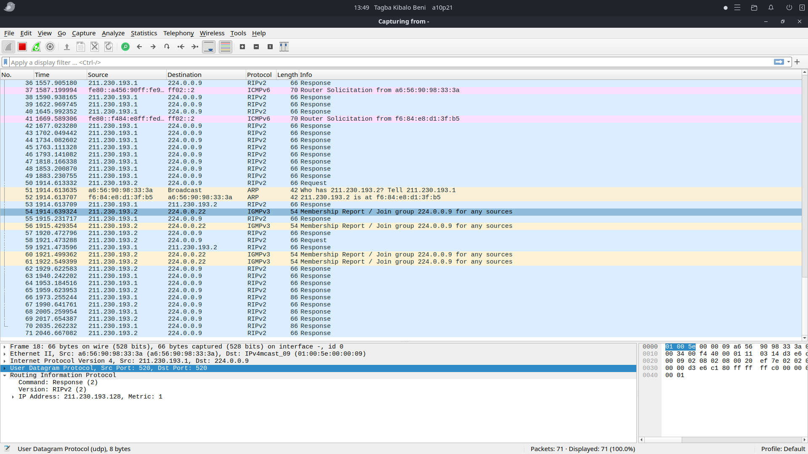

**Intérêt du message de requête :**

> Au lieu d'attendre 30 secondes pour recevoir une mise à jour non sollicitée, R2 envoie immédiatement un Request dès l'activation de RIP pour obtenir les routes de ses voisins tout de suite. Ça accélère la convergence du réseau.

---

### Question 7 — Différences entre réponses RIP de R1 et sa table de routage

**Table de routage R1 (`show ip route`) Capture Wireshark réponses RIP de R1 :**
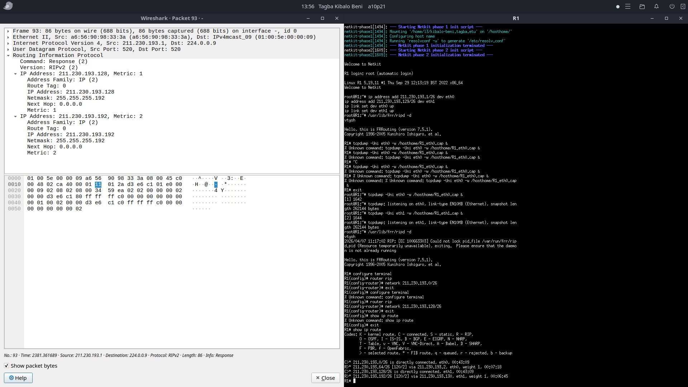

**Différences constatées :**

> R1 n'annonce pas le réseau a (211.230.193.0/26) dans sa réponse sur eth0 / R1 n'annonce pas le réseau A (211.230.193.64/26) non plus / La métrique de B est 2 dans l'annonce alors qu'elle est 1 dans la table

**Pourquoi ces différences (explication du mécanisme) :**

> split horizon (pas d'annonce d'une route sur l'interface depuis laquelle elle a été apprise) / même raison, il l'a appris depuis eth0 / R1 incrémente la métrique de +1 avant d'annoncer

---

### Question 8 — Métriques

**Capture Wireshark :**
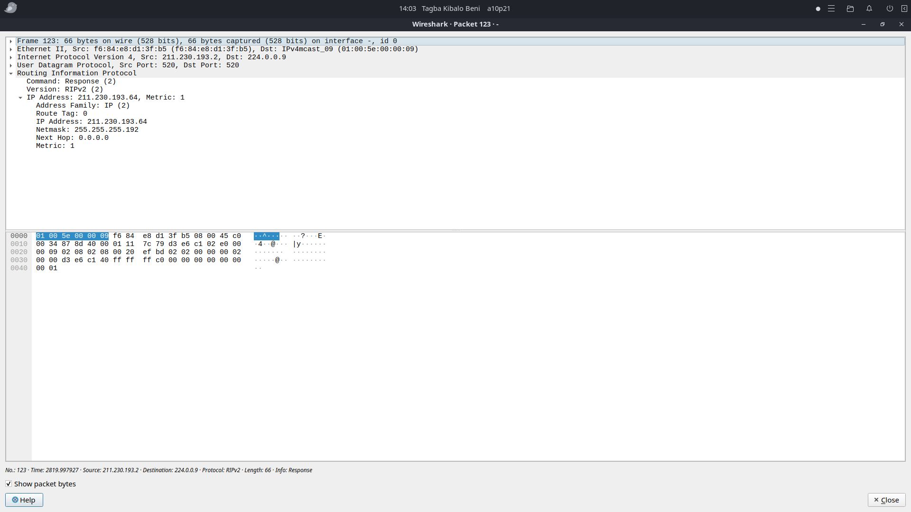
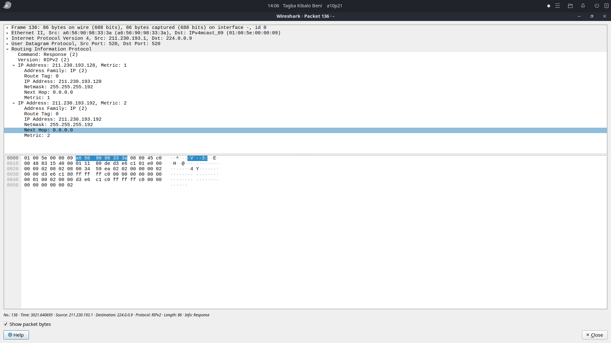

**Métrique de A dans les annonces de R2 :**

> 1

**Métrique de A dans les annonces de R1 :**

> 2

**Métrique de A dans les annonces de R3 (selon vous) :**

> 3

**À quoi correspond la métrique :**

> La métrique = nombre de sauts

---

### Question 9 — Tables de routage et métriques

**Table de routage :**
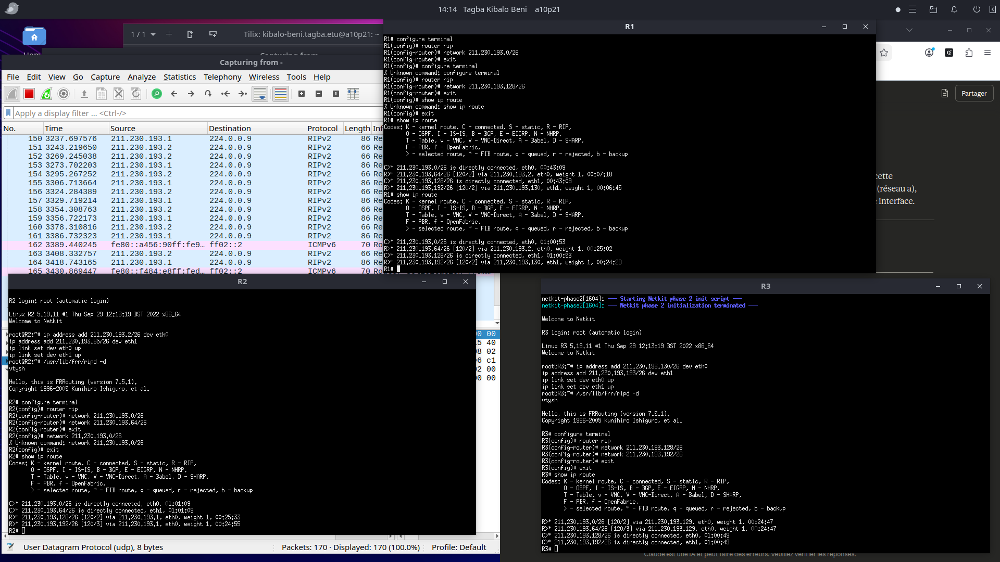


**Si on ajoutait un lien direct R2-R3, quelle serait la métrique de A sur R3 ?**

>  la métrique de A sur R3 serait 2 (directement via R2, sans passer par R1).

---

### Question 10 — Simulation panne eth1 de R2

**Commande utilisée :**
```bash
ip link set dev eth1 down
```

**Capture Wireshark (messages RIP après panne) :**
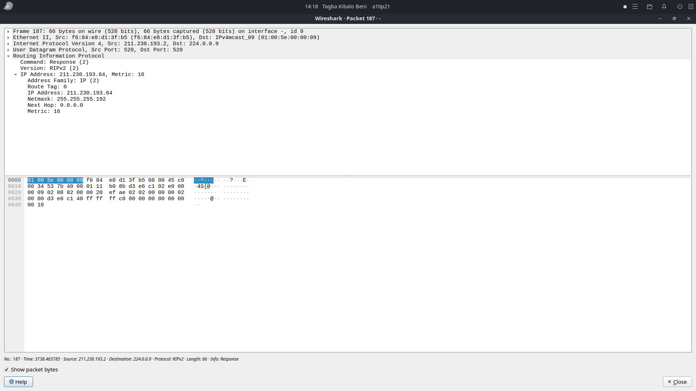

**Constat sur les messages RIP reçus et envoyés par R1 :**

> R1 ne reçoit plus rien de R2 concernant A
> R1 n'annonce plus le réseau A dans ses propres réponses
> R1 a donc retiré A de sa table de routage et ne le propage plus à R3

**Métrique associée au réseau A inaccessible :**

> 16

**Pourquoi cette valeur est-elle utilisée ? Que signifie-t-elle ?**

> Dans RIP, 16 est la valeur conventionnelle pour signifier "infini" — c'est le mécanisme de poison reverse. RIP ne peut pas avoir de routes avec plus de 15 sauts, donc 16 = inaccessible.
> Le réseau A est inaccessible depuis R2.

**Délai entre la panne et la suppression de la route vers A dans R3 :**

> environ 180 sec

---

### Question 11 — Désactiver eth0 de R2 — timeout de R1

**Commandes utilisées :**
```bash
ip link set dev eth1 up   
ip link set dev eth0 down 
```

**Capture Wireshark (surveillance des annonces de R1) :**
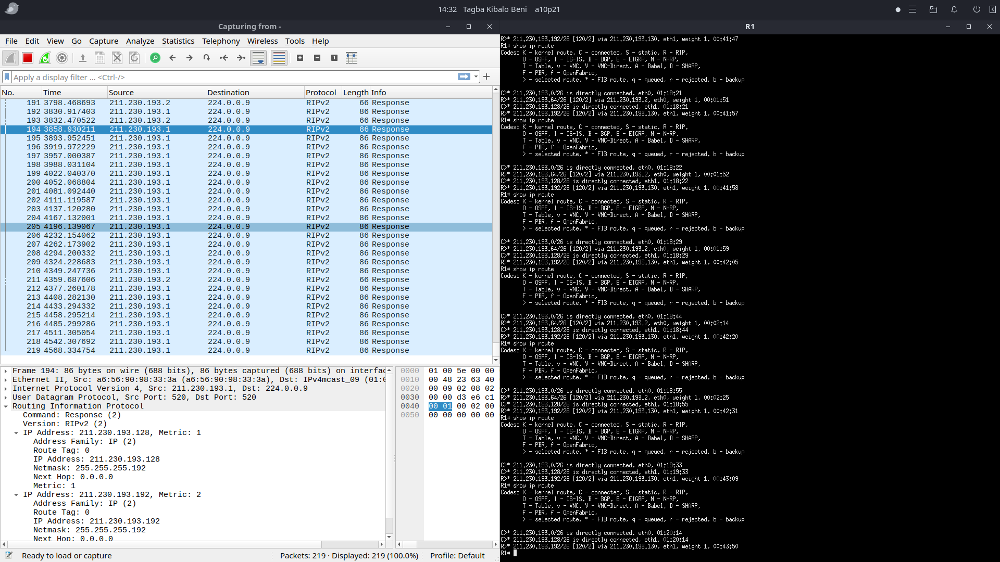

**Au bout de combien de temps R1 considère A inaccessible (timeout) :**

> Timeout de R1 : ~180 secondes 
>Dans Wireshark, le dernier message RIP de R2 (211.230.193.2) est le paquet 193 à t = 3832s.
>Dans le terminal R1, en suivant les show ip route successifs :

>À 01:18:21 → R* 211.230.193.64/26 still présent
>À 01:18:22 → R* 211.230.193.64/26 still présent
>À 01:19:33 → R* 211.230.193.64/26 disparue !

---

### Question 12 — Routeur PIRATE et attaque RIP

**Commandes de lancement et configuration de PIRATE :**
```bash
vstart -D PIRATE --eth0=A
# Configurer eth0 avec une IP dans le réseau A (211.230.193.64/26)
ip address add 211.230.193.100/26 dev eth0
ip link set dev eth0 up
```

**Commande création dummy0 :**
```bash
ifconfig dummy0 <IP_dans_B> netmask 255.255.255.0 up
```

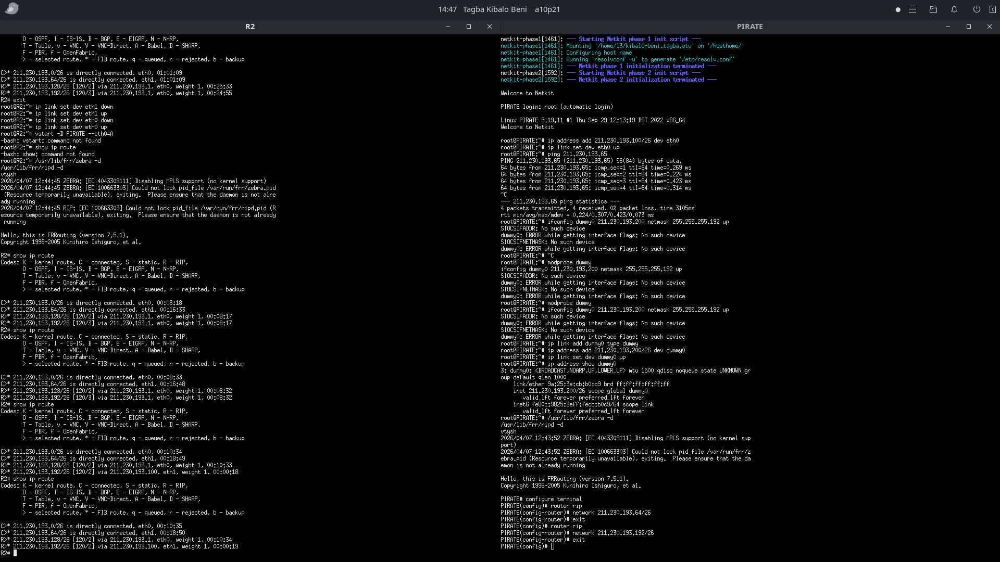

**Constat concernant le réseau B :**

>  R2 a maintenant une route vers le réseau B (211.230.193.192/26) via 211.230.193.100 (PIRATE) avec métrique 1, au lieu de passer par R1. PIRATE a réussi à usurper la route vers B en annonçant frauduleusement ce réseau via RIP.

**Comment remédier à ce problème :**

> Configurer l'authentification MD5 sur les échanges RIP pour que les routeurs n'acceptent que les annonces de voisins de confiance :

---

## Section 5 — NAT (bonus)

> ⚠️ Routeurs précédents arrêtés. Nouveaux routeurs lancés : box, PC, R-FAI.

---

### Question 1 — Plan d'adressage privé réseau interne

| Machine | Interface | Réseau | Adresse IP/CIDR |
|---------|-----------|--------|-----------------|
| PC | eth0 | L1 (interne) | |
| box | eth1 | L1 (interne) | |

**Commandes de configuration :**
```bash
# À compléter
```

**Vérification :**
<!-- Insérer capture ici -->

---

### Question 2 — Réseau public réseau externe

| Machine | Interface | Réseau | Adresse IP/CIDR |
|---------|-----------|--------|-----------------|
| box | eth0 | L2 (externe) | |
| R-FAI | eth0 | L2 (externe) | |

**Commandes de configuration :**
```bash
# À compléter
```

**Vérification :**
<!-- Insérer capture ici -->

---

### Question 3 — Configuration NAT sur box

**Commandes utilisées :**
```bash
echo 1 > /proc/sys/net/ipv4/ip_forward
iptables -t nat -A POSTROUTING -o eth0 -j MASQUERADE
```

**Explication de la règle :**

>

---

### Question 4 — Routes nécessaires

**Routes configurées sur PC :**
```bash
# À compléter
```

**Routes configurées sur box :**
```bash
# À compléter
```

**Routes configurées sur R-FAI :**
```bash
# À compléter
```

**Explication :**

>

---

### Question 5 — Captures et analyse NAT

**Capture Wireshark eth1 de box (côté PC) :**
<!-- Insérer capture ici -->

**Capture Wireshark eth0 de box (côté R-FAI) :**
<!-- Insérer capture ici -->

**Adresse source du paquet reçu de PC :**

>

**Adresse source du paquet envoyé vers R-FAI :**

>

**Adresse de destination de la réponse de R-FAI :**

>

**Adresse de la réponse envoyée par box vers PC :**

>

**Conclusion sur l'intérêt du NAT :**

>

---

### Question 6 — Redirection port HTTP vers PC

**Commande netcat sur PC :**
```bash
nc -lp 8080
```

**Règle iptables DNAT sur box :**
```bash
iptables -t nat -A PREROUTING -i eth0 -p tcp --dport 80 -j DNAT --to-destination <IP_PC>:8080
```

**Explication :**

>

---

### Question 7 — Vérification depuis R-FAI

**Commandes utilisées :**
```bash
nmap <IP_externe_box> -p 80
telnet <IP_externe_box> 80
```

**Capture / sortie nmap :**
<!-- Insérer capture ici -->

**Capture / sortie telnet :**
<!-- Insérer capture ici -->

**Résultat et conclusion :**

>

---

*Fin du compte-rendu*
